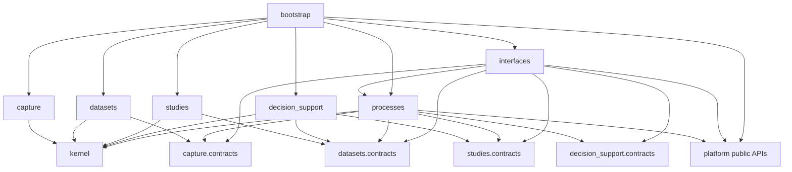
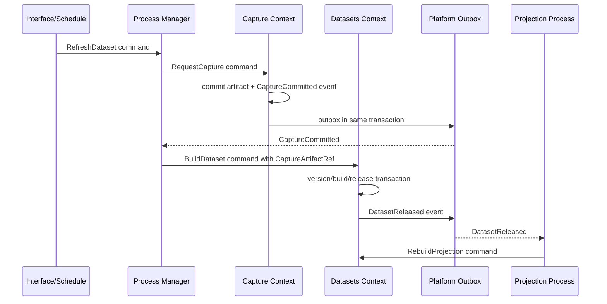
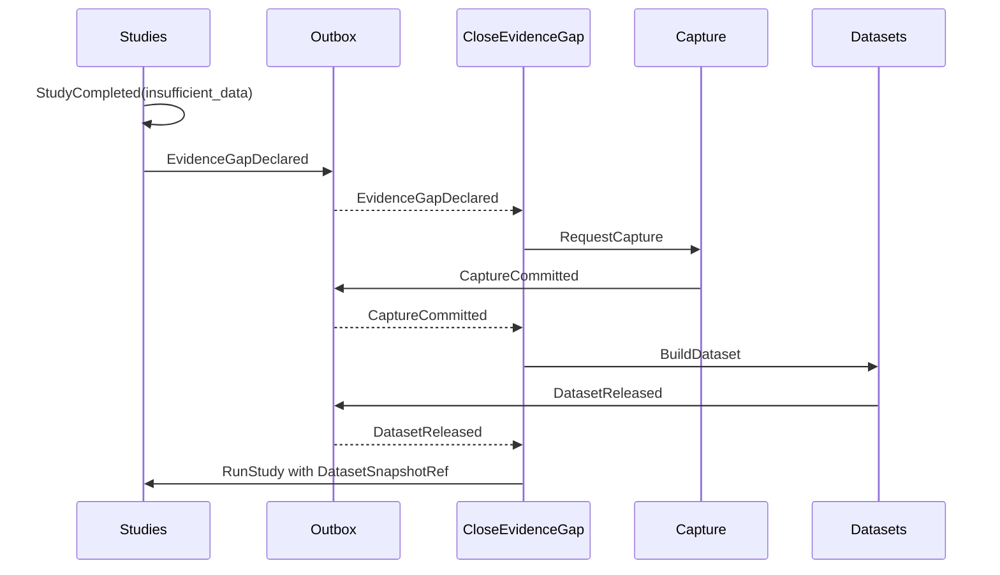
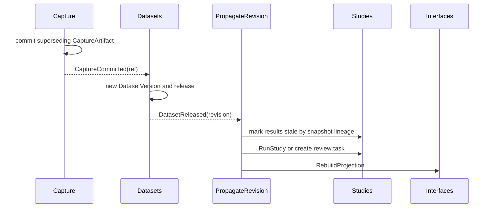
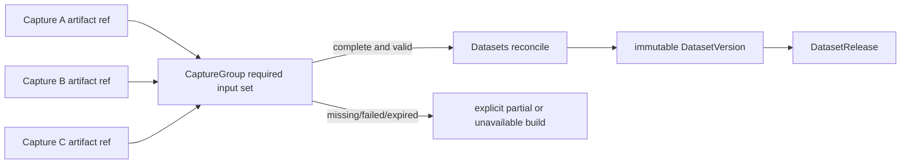
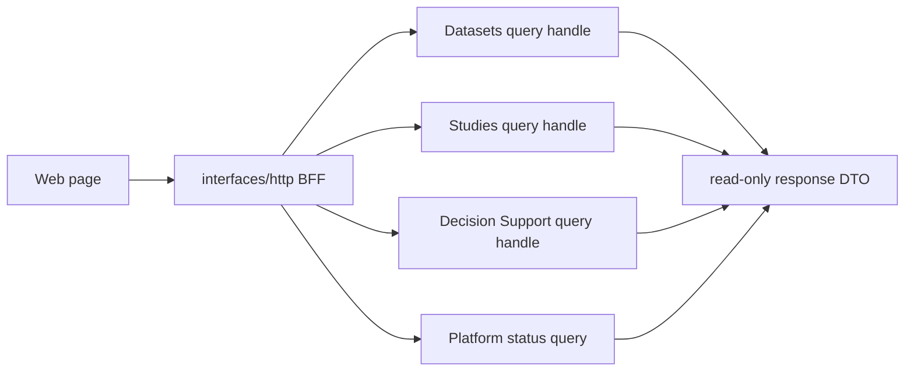
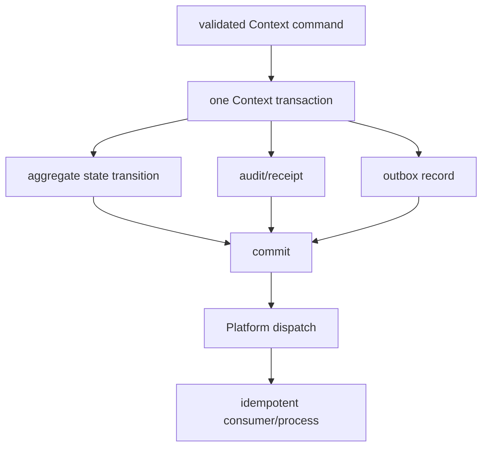

# Trade Architecture Restructure v1

## Context

This governed change designs the target architecture and migration controls for
Trade. It records no production source move, import edit, data migration or
runtime behavior change. The current `master` tree remains the implementation
baseline; this document is a contract for independently reviewable future
changes.

The design has two premises:

1. Code dependencies must be acyclic and locally understandable.
2. Runtime work can still be non-linear: capture may fan out to products,
   products may join multiple captures, a study may declare an evidence gap,
   and revision may invalidate downstream results.

The answer is not a new global service layer. It is a domain-modular monolith
with immutable cross-context references, explicit command/event contracts,
outbox delivery and stateful process managers.

## Current-State Audit

### Evidence and scope

The audit was source-only. It did not open, alter, migrate or write real data,
SQLite files, parquet files, provider endpoints or generated artifacts. The
historical architecture documents in `docs/` informed vocabulary only; all
current-state claims below derive from code and repository configuration.

| Audited area | Current code fact | Consequence for target design |
|---|---|---|
| CLI | Root `trade` is the stable Bash facade; `trade_py/cli/main.py` registers canonical `run`, `status`, `data`, `show`, `research`, `kg`, `observatory`, `config`, `event`, `backup`, `start`, `web`, `dev` plus legacy shims. | Keep external command names and aliases. Internal Context names do not become an immediate CLI rename. |
| Database | `trade_py/db/trade_db.py` is about 4,690 lines. Its constructor opens SQLite and schema setup spans settings, events, jobs, asset metadata, quality, research, causal decisions and KG. | Replace use of it gradually with context-owned repositories and compatibility delegates; never replace it with a renamed global facade. |
| Migrations | `trade_py/db/migrations.py` centrally changes unrelated tables and historical migrations include rename/alter operations. | New migrations must be owned by the context whose facts they change, remain additive/reversible and retain old readers through the compatibility window. |
| Read paths | `trade_py/data/access/gateway.py` documents readers that can fetch, repair and record work. `get_kline`, `get_fund_flow` and `ensure_sentiment_gold_date` can create side effects. | Formal query contracts are read-only; repair/backfill becomes a command routed through Capture and Processes. |
| Market artifacts | `trade_py/data/market/crypto/service.py` captures provider payloads with hashes and retry evidence. `store.py` stages manifest-bound artifacts, checks predecessor hashes, publishes a current pointer and supports rollback. | Preserve these useful primitives but separate provider interaction from canonical dataset construction/publication. |
| Warehouse | `trade_py/data/warehouse` materializes data and validation artifacts. | Reclassify each artifact as a Dataset product, a Study-local result or a compatibility projection, instead of moving the directory wholesale. |
| Observatory | `trade_py/observatory/domain/models.py` already models `ArtifactRef`, immutable run projections, `Release` and `SnapshotContext`; its catalog SQLite is explicitly rebuildable. | Retain the models' reference concepts and catalog projection behavior, but route them to Datasets/Studies contracts and Interfaces BFFs. Observatory is not a target business context. |
| PIT | `trade_py/observatory/pit/resolver.py` filters by `available_at` or `fetched_at`, but currently keeps rows whose chosen timestamp is absent; `latest_restated` only flags and does not transform revisions. | A child change must make formal PIT resolution fail closed for absent required clocks and define real restatement semantics with golden tests. |
| Event runtime | `trade_py/bus` has durable event records, channel admission and replay. `trade_py/jobs/__init__.py` is a large job registry/execution concentration coupled to the bus. | Treat current bus mechanics as a Platform seed; extract business job behavior to context use cases and process managers. |
| Web | `trade_web/backend/app.py` is about 3,781 lines and mixes routes, BFF reads, direct DB/parquet access and operational writes. `runtime/` already has a resource container and router; `observatory/router.py` is a read-only focused router. | Preserve current routes with `interfaces/http/compat`; use the existing focused-router pattern as a migration path. |
| Frontend | `trade_web/frontend/src/lib/api.ts` currently exposes `today`, `candidates`, `symbol`, `ops`, `research`, `data`, `observatory`; product widgets also expose Actions and Trust endpoints. | Existing pages remain product surfaces. Future BFFs compose query handles rather than directly own tables or lifecycle actions. |
| Notebook | `research/notebooks/btc_h1_observatory.py` changes `sys.path` to find repository modules. | Create an SDK/Notebook contract before moving notebook locations; prohibit repository scanning and adapter imports after cutover. |
| C++ | `engine/` is independently built. `engine/cmake/python_bindings.cmake` plans a `trade_py` binding that is not an established working boundary; `trade_py/__init__.py` self-imports as a native probe. | C++ remains an adapter implementation. A future binding is `_trade_native`, accessed only behind a Context port. |

### Current artifact and table inventory

The following is an ownership classification inventory, not a claim that every
listed table exists with exactly the intended future schema. Existing names
remain readable through compatibility repositories until the owning child change
has completed its exit criteria.

| Current facts/artifacts | Current code owner | Target classification | Evidence |
|---|---|---|---|
| `asset_registry`, `sync_state`, provider cursors, raw response files, crypto `runs/*/raw` | `TradeDB`, data CLI, crypto service/store | Capture source/checkpoint/request/run/artifact records | `trade_py/db/trade_db.py`, `trade_py/data/market/crypto/*` |
| crypto `runs/*/{primary,shadow,canonical,reconciliation,revisions}.parquet`, manifests and current pointer | BTC run store | Capture artifacts plus Dataset build inputs, DatasetVersion output and compatibility release pointer | `trade_py/data/market/crypto/store.py` |
| `dataset_snapshots`, `daily_quality_gate`, `source_health_daily`, `source_eval_daily`, warehouse parquet and catalog SQLite | `TradeDB`, warehouse, Observatory catalog | Datasets versions/snapshots/releases/quality/projections | `trade_py/db/trade_db.py`, `trade_py/data/warehouse/*`, `trade_py/observatory/catalog/store.py` |
| `factors`, `factor_registry`, `model_registry`, `event_eval_runs`, `model_eval_runs`, H1 receipts | `TradeDB`, research/factor/model CLI and Observatory workflow | Studies, except reusable independently versioned features become derived Datasets | `trade_py/db/trade_db.py`, `trade_py/cli/research.py`, `trade_py/observatory/research/workflow.py` |
| `signals`, `Recommendation`, `RecommendationTrace`, causal decision snapshots/outcomes/reward records, picks/actions | `TradeDB`, services and Web routes | Decision Support cases/reviews/rationales/overrides/intents; historical compatibility projections | `trade_py/db/trade_db.py`, `trade_py/services/*`, `trade_web/backend/app.py` |
| `event_log`, `event_handler_runs`, `bus_events`, delivery/replay state | EventBus and `TradeDB` | Platform events/outbox/delivery state | `trade_py/bus/*`, `trade_py/db/migrations.py` |
| `job_runs`, execution receipts, agenda scheduling | `TradeDB`, jobs, runtime commands | Platform execution and Processes state, with an explicit split of generic receipt versus business process state | `trade_py/db/trade_db.py`, `trade_py/jobs/__init__.py`, `trade_web/backend/runtime/*` |
| `settings`, backup snapshots and runtime configuration | `TradeDB`, CLI config/backup | Platform settings and backup | `trade_py/db/trade_db.py`, `trade_py/cli/config.py`, `trade_py/cli/backup.py` |
| `instruments`, `sector_members`, trading calendar, planned events | `TradeDB` | Dataset reference products, with scheduling projection reads through contracts | `trade_py/db/trade_db.py` |
| KG nodes/relations/candidates, market events and propagation | `TradeDB`, KG CLI | File-by-file classification during Studies/Datasets child changes; no bulk directory move is authorized by this design | `trade_py/db/trade_db.py`, `trade_py/cli/kg.py` |
| `ui_snapshots`, local UI state | `TradeDB`, Web | Rebuildable Interfaces/Platform projections; never business authority | `trade_py/db/trade_db.py`, `trade_web/frontend/src/*` |

### Facts, design assumptions and deferred classification

Facts above name current modules and observed behavior. The following target
decisions are design assumptions requiring validation in their owning child
change:

- Exact physical table names for `capture_requests`, `dataset_versions`,
  `study_runs`, `decision_cases`, `outbox` and process state will be selected
  through additive migration design, not inferred from the desired names.
- Legacy KG, causal and recommendation records require row-level analysis before
  final target ownership. They are not automatically Studies merely because they
  look analytical, and they are not automatically Decision Support merely
  because they affect a decision.
- The first release can retain one SQLite database and existing parquet roots.
  Logical repository ownership is mandatory even when physical separation is
  deferred.
- Stream/L2 and remote worker providers use the same Capture contracts but need
  a separate capacity and storage sizing proposal before production activation.

## Problems and Root Causes

1. **Ownership is implicit rather than local.** A global DB facade, broad CLI
   modules and a large Web application own facts from multiple domains. A caller
   cannot infer which transaction, migration, lifecycle state or compatibility
   promise applies from the module it imports.
2. **Reads can mutate or acquire external state.** DataGateway repair behavior
   makes resource cost and causal provenance unavailable to consumers that only
   requested a query. A GET path that marks stale state has the same problem.
3. **Artifact identity is uneven.** BTC has strong manifest/hash/pointer
   primitives, while other paths can derive values from current files, direct
   DB queries or moving latest aliases. Formal research cannot be reproducible
   until all inputs are immutable references.
4. **Runtime coupling hides long process state.** Scheduler, event handlers,
   jobs, CLI and routers can each trigger work, but a cross-context refresh or
   evidence-gap loop has no single durable owner with an idempotency key,
   deadline, compensation state and recovery trace.
5. **Interface code is doing business work.** Web and CLI currently include
   orchestration, direct SQL/parquet work and lifecycle changes. That makes a
   path extraction or product page change high risk.
6. **Temporal claims need a stricter authority.** Existing Observatory models
   contain useful clocks and immutable views, but missing timestamps can be
   rendered visible and restatement policy is not yet a distinct transformation.
7. **Directory names are not reliable owners.** Existing `analysis`,
   `evaluation`, `evidence`, `observatory`, `factors` and `intelligence`
   contain mixed responsibilities. A directory move would reproduce the
   coupling under prettier names.

## Design Quality Brief

### Requirements and acceptance

The architecture must allow a maintainer to answer, for any formal fact, who
owns it, how it was produced, which immutable references were used, what state
it is in, and how it is recovered. It must preserve existing human and program
entry points while enabling an incremental route from `trade_py` and
`trade_web/backend` to `src/trade`.

Acceptance of this design requires:

1. The eight capability specifications define Capture, Dataset, Study, Decision
   Support, Process, compatibility, dependency and migration behavior with
   executable scenarios.
2. Every target cross-context input is a reference or DTO from an upstream
   `contracts` package. Formal Study execution accepts `DatasetSnapshotRef`
   only.
3. Each future context has a state machine, authoritative transaction boundary,
   repository owner, immutable output and explicit unavailable/quarantine
   outcomes.
4. Existing CLI, HTTP/SSE, Web, SDK, notebook, scheduler and event entrance
   behavior has a documented compatibility owner and a removal condition.
5. Process managers cover refresh, evidence-gap closure, revision propagation,
   study run, publication, projection rebuilding and daily workspace production
   without cyclic source imports or cross-context transactions.
6. Migration work is split into independently reversible child changes with
   temporary-root tests, contract snapshots and compatibility gates.

Users are researchers, operators, Web users, CLI/SDK consumers and future
automation adapters. Non-goals are changing trading semantics, validating a
recommendation model, moving all code at once, or enabling a new external
provider in this design-only change.

### Ownership and boundaries

Business ownership is limited to Capture, Datasets, Studies and Decision
Support. Each has `contracts`, `domain`, `use_cases`, `ports` and `adapters`.
The owner of a context writes its state and migration history; another context
does not read its tables or import its implementation.

`processes` owns only cross-context long-running state and sends commands to
contexts. `platform` owns technical mechanics without business vocabulary.
`interfaces` adapts existing entrances and page BFFs. `bootstrap` is the sole
composition root allowed to import concrete adapters, repositories, use cases,
process managers and platform implementations.

The current `TradeDB` remains a compatibility facade during transition. It is
not a target owner. Compatibility delegation is temporary and is retired only
after the named context repository, query projection and contract suite are
stable for the defined window.

### Data and state invariants

Identifiers are globally unique, immutable and opaque. A digest identifies
content bytes using a recorded algorithm; a logical reference identifies a
declared version plus its content digest. A mutable alias such as `current` or
`latest` is a projection pointer and is never a formal DatasetBuild or StudyRun
input.

Capture records provider interaction and raw response identity. Dataset builds
consume only immutable capture/dataset references. Dataset releases point to
immutable versions/snapshots and may be superseded or withdrawn without
mutating prior versions. Study runs consume one or more pinned
`DatasetSnapshotRef` values and emit a result with explicit validated,
rejected, insufficient-data, stale or unavailable state. Decision Support may
reference Dataset snapshots and Study results but cannot change either.

Every temporal product preserves `event_time`, `observed_time`,
`available_time`, `first_seen_time`, `fetched_or_received_time` and
`revision_time` when applicable, with UTC storage and explicit source timezone
metadata. A required clock that is absent is explicit unavailable for formal PIT
resolution. It is never silently treated as visible. Exact versus estimated
time provenance is carried in the reference/quality report.

### Contracts and compatibility

The Bash `trade` facade and Python canonical domains remain external contracts.
HTTP path/method/query/path/body/status/response/error/SSE inventories are
snapshotted before delegation. Web pages retain route, URL/local state and
payload expectations. Current `trade_py` imports, current parquet files and
SQLite table readers remain supported through adapters during the transition.

New stable contracts are versioned immutable refs, commands, past-tense events,
query DTOs and capability interfaces. Contracts do not expose ORM objects,
connections, DataFrames, file paths or concrete repositories. New interface
forms are additive until a published compatibility window and migration checks
permit retirement.

### Persistent-write safety

Each context has one authoritative writer and one local transaction boundary.
The owner commits aggregate transition, immutable receipt or reference, audit
record and outbox entry atomically. Capture commits raw bytes only after digest
and receipt validation; Datasets advances a release only after its immutable
product and quality result are durable; Studies and Decision Support append
results and rationale rather than rewriting prior facts. Cross-context work
uses idempotent delivery and process state, not a shared SQLite transaction.

### Schema migration compatibility

Schema changes are additive versioned changes owned by the Context repository
whose facts change. Existing SQLite/parquet readers remain available through
backward and forward compatibility adapters during a minimum 30-day window.
The owning child change uses an idempotent checkpointed replay, dual-read
comparison or a readiness-gated pointer switch before cutover. Rollback selects
the verified prior generation or backup snapshot and never deletes new
immutable records merely to restore old code.

### Point-in-time and predictive evidence

Datasets owns the immutable snapshot and knowledge clock required by formal
Studies. Event, publication, first-seen, available, observed and revision time
are stored in UTC with source/time-confidence provenance. Missing required
clocks block formal PIT visibility. A StudySpec pins a universe, horizon,
benchmark, validation window and feature/label definitions; a result records
coverage, sample count, uncertainty, calibration state and explicit unavailable
or insufficient-data outcome rather than inventing a numeric fallback.

### External-event data safety

Capture validates every external interaction against a SourceManifest that
identifies the source, provenance, license, request budget, concurrency, retry
classification, circuit breaker and availability state. Pull, push, stream,
import, replay, correction and tombstone behavior writes immutable receipts,
durable deduplication keys and quarantine/dead-letter evidence. Provider
unavailability, invalid content and rate limits remain explicit states; replay
uses committed artifacts and never silently repeats a provider request.

### Failure and recovery

Invalid commands fail before a context transaction and return stable
machine-readable reason codes. Provider timeout, rate limit and transient
failures create a failed/deferred CaptureRun with bounded retry classification;
raw bytes are committed only after receipt integrity checks. A corrupt prior
artifact, missing required clock, failed reconciliation or unmet quality
threshold creates a quarantined/unavailable Dataset outcome rather than a
silent formal release.

Every process has a durable idempotency key and resumes from its latest
committed step after crash. Duplicate command delivery returns the existing
receipt/process result. Outbox records are committed atomically with the
context state transition; delivery can repeat, so event consumers are
idempotent. A compensation only changes a pointer or creates a later record; it
does not rewrite a previously immutable artifact.

### Performance and capacity

This design makes no unsupported throughput promise. Future child changes must
measure baseline cost from temporary fixtures and production-safe telemetry
before changing limits. Capture provides per-source bounded concurrency, rate
limits, request budgets and circuit breakers. Large payloads are streamed to
immutable segments; runtime envelopes carry references rather than frames or
raw bodies.

Dataset and Study builds execute as bounded platform executions with a timeout,
cancellation state and resource receipt. Process managers use a bounded
in-flight set and deadline, wait for required joins rather than spin, and
coalesce duplicate refresh/evidence-gap requests by idempotency key. BFF queries
have finite pagination/window limits and may compose bounded parallel reads, but
never invoke provider fetch, repair or lifecycle write.

### Observability and operations

Every capture, build, release, study, decision and process exposes a correlation
ID, causation ID, idempotency key, state, current step, source/version
references and safe failure code. Context audit records retain actor, command,
time, input references, output references and policy versions. Platform events
retain delivery state and process execution retains timing, retry and
cancellation evidence.

Status responses distinguish `empty`, `partial`, `degraded`, `unavailable`,
`quarantined`, `stale`, `blocked` and `failed`; none is represented as a
successful empty result. `trade status`, Operations and Data Ops become query
surfaces over those explicit states. Logs and metrics do not contain raw
provider payloads or credentials; artifact digests and opaque IDs enable
diagnosis.

### Validation strategy

Future implementation uses temporary data roots and fixtures only. Required
coverage includes import-dependency guardrails, contract snapshots, immutable
reference replay, PIT golden fixtures, capture replay, lineage, deterministic
Study rerun, process recovery/idempotency, database owner checks, read-only
query checks, C++/Python differential tests and migration rollback tests.

Each child change runs `./trade dev check --show-plan`, `./trade dev check`,
focused tests, language-specific build/type checks and `git diff --check`.
Before every implementation begins, the applicable design remains strict
approved; before merge, the changed implementation diff receives a new
six-role review. Any use of real data is a separately approved read-only probe
and does not substitute for fixture coverage.

### Alternatives and trade-offs

**Big-bang `src/trade` move:** superficially improves directory appearance but
changes imports, packaging, adapters and public surfaces together. It prevents
isolation of behavior regressions and has no independent rollback. Rejected.

**Keep `TradeDB` and add a façade above it:** reduces immediate code churn but
retains a cross-domain owner and merely moves callers to a new catch-all API.
Rejected.

**One shared Evidence/Quality context:** appears to centralize assurance but
splits Dataset lifecycle facts from their owning product and duplicates
authority. Rejected. Quality, lineage, revision, PIT, catalog and release are
Datasets responsibilities.

**Synchronous cross-context service calls:** can be simpler for a linear
refresh, but creates import cycles, coupled transactions and opaque recovery
when evidence gaps or revisions feed back. Rejected for cross-context work.

**Domain-modular monolith with contracts and process managers:** retains local
deployment and SQLite practicality while separating code ownership from
non-linear runtime coordination. It has more explicit contracts and migration
discipline, but those costs directly address reproducibility, compatibility and
recovery. Selected.

### Rollout and rollback

Rollout begins with static dependency guardrails and public contract baselines,
then adds Kernel/contracts, then Capture, Datasets, Studies, Processes/Platform
and interfaces, before any package layout move or legacy retirement. Every
child change is independently reviewable, worktree-isolated and feature-gated
by compatible adapters.

Schema evolution is additive-versioned and retains old versions until both
forward and backward readers have passed comparison fixtures. New records are
dual-written only through the owning repository and only when an explicit
idempotent replay/shadow-copy plan exists. Cutover uses dual-read comparison or
a versioned pointer switch with a readiness gate. Rollback restores the prior
pointer or prior code path and retains immutable new artifacts for audit; it
does not delete data to make a rollback appear clean.

## Selected Architecture

### Target repository layout

```text
src/trade/
  kernel/
    ids.py time.py digest.py errors.py result.py envelope.py
  capture/
    contracts/ domain/ use_cases/ ports/ adapters/
  datasets/
    contracts/ domain/ use_cases/ ports/ adapters/
  studies/
    contracts/ domain/ use_cases/ ports/ adapters/
  decision_support/
    contracts/ domain/ use_cases/ ports/ adapters/
  processes/
    refresh_dataset/ close_evidence_gap/ propagate_revision/
    run_registered_study/ publish_dataset/ rebuild_projection/
    generate_daily_workspace/
  platform/
    execution/ events/ scheduling/ persistence/ settings/ backup/
  interfaces/
    cli/ http/ sdk/ events/ schedules/ imports/
  bootstrap/

web/
engine/
tests/
tools/
examples/
docs/
openspec/
config/
deployment/
```

The layout is a destination, not a permission to move current directories.
`trade_py/` and `trade_web/backend/` are compatibility roots until the
`python-package-and-web-layout` child change has passed packaging, CLI, HTTP,
SDK and import-contract validation.

### Bounded contexts

| Context | Owns | Stable outputs | Must not own |
|---|---|---|---|
| Capture | SourceManifest, CaptureRequest, CapturePlan, CaptureRun, CaptureArtifact, CaptureArtifactRef, CaptureGroup, CaptureCheckpoint, transport receipt | raw content artifact, receipt, checkpoint, supersession link | canonical schema, Dataset release, PIT, quality conclusion, feature, hypothesis, recommendation |
| Datasets | DatasetVersion, DatasetVersionRef, DatasetSnapshot, DatasetSnapshotRef, DatasetRelease, DatasetBuild, QualityReport, Lineage | canonical version/snapshot, release, quality/quarantine result, catalog projection | provider interaction, formal Study inference, decision case |
| Studies | Study, Hypothesis, StudySpec, StudyRun, ValidationReport, StudyResult, StudyResultRef, PromotionReceipt, EvidenceGap | validation/result/promotion or explicit insufficient-data/rejection outcome | provider/raw reads, direct Capture call, current alias resolution, Decision Support state |
| Decision Support | DecisionCase, Review, Rationale, Override, PortfolioIntent, Expiry, AuditTrail | reviewed human-assist decision evidence and intent | source acquisition, Dataset/Study mutation, execution expansion |

`platform` has no instrument, market, Dataset, Study, recommendation or
portfolio business terms. `processes` has no authority to mutate an aggregate
except by an owning context command. `interfaces` has no business table owner.

### Context cell and internal rules

Every business context uses:

```text
<context>/
  contracts/
  domain/
  use_cases/
  ports/
  adapters/
```

`contracts` exports immutable refs, command/event/query DTOs and capability
interfaces. `domain` only depends on Kernel. `ports` describes required
external capability. `use_cases` depends on own domain/ports/contracts and
upstream contracts. `adapters` implements own ports using external libraries.

One use case file owns one behavior, for example `request_capture.py`,
`commit_capture.py`, `build_dataset.py`, `publish_dataset.py`,
`resolve_snapshot.py`, `run_study.py`, `promote_study.py`. The architecture
does not introduce catch-all `service.py`, `manager.py`, `facade.py`,
`utils.py` or `helpers.py`.

### Kernel admission rule

Kernel contains only `ids`, `time`, `digest`, `errors`, `result` and
`envelope`. A type enters Kernel only when all are true:

1. At least two contexts use it.
2. Its semantics are identical in every use.
3. It has no business owner.
4. It does not depend on a framework or concrete adapter.
5. It is expected to remain stable over the migration window.

Small context-local duplicate value objects are preferable to a premature
shared abstraction.

## Aggregate and State Machine Definitions

### Capture

`SourceManifest` defines provider identity, approved contract, rate/quota
policy, request grammar, source timezone, credentials reference and retention
policy. `CaptureRequest` is immutable intent. `CapturePlan` expands request
partitions/segments. `CaptureRun` owns attempt state, while
`CaptureArtifact` owns committed raw bytes and digest.

```text
CaptureRequest: requested -> planned -> dispatched -> completed | failed | cancelled
CaptureRun:     created -> running -> received -> committed | retryable_failed |
                terminal_failed | cancelled
CaptureArtifact: provisional -> committed -> superseded | retained | tombstoned
```

`committed` requires a receipt with source, request identity, mode, timestamps,
content digest, content type/encoding, segment/cursor identity and retry
classification. A successful empty response is a committed artifact with
`availability=empty`, not a missing run. Replay reads the existing artifact and
creates a new replay receipt; it never recontacts the provider.

Supported graph forms are explicit:

- one CaptureArtifact can be consumed by many DatasetBuilds;
- a DatasetBuild can consume a declared set of CaptureArtifactRefs;
- a CaptureGroup gathers multi-source artifacts before a join;
- stream segments are separate immutable artifacts with ordered checkpoint
  lineage;
- a later CaptureArtifact supersedes prior artifact identity through a link,
  never by overwriting raw bytes.

### Datasets

`DatasetBuild` records declared immutable inputs, schema/version policy,
transform code identity, quality profile and output candidate. `DatasetVersion`
is immutable canonical content. `DatasetSnapshot` pins a selection of versions
and a knowledge/revision policy. `DatasetRelease` is the mutable publication
record pointing to an immutable output.

```text
DatasetBuild:     requested -> building -> validated -> candidate |
                  quarantined | failed | cancelled
DatasetVersion:   candidate -> released | superseded | withdrawn | retained
DatasetSnapshot:  created -> resolved -> expired | retained
DatasetRelease:   unpublished -> published -> superseded | withdrawn
QualityReport:    pending -> passed | warned | blocked | quarantined
```

A formal build accepts only `CaptureArtifactRef`, `DatasetVersionRef` and
`DatasetSnapshotRef`. It may produce no release when inputs are incomplete,
schema-invalid, duplicate-conflicted or quality-blocked. Catalogs and UI caches
are rebuildable projections and do not become a second authoritative fact
store.

### Studies

`Study` owns intent and lifecycle. `Hypothesis` is preregistered claim/version.
`StudySpec` pins feature/label definition, universe, sample, method, benchmark,
walk-forward and multiple-testing policy. `StudyRun` pins only DatasetSnapshot
references. `StudyResult` is immutable and its status is explicit.

```text
Study:       drafted -> registered -> active -> retired
StudyRun:    requested -> running -> validated -> completed |
             insufficient_data | rejected | failed | cancelled
StudyResult: observed -> validated | rejected | stale | expired
Promotion:   proposed -> promoted | declined | revoked
EvidenceGap: declared -> accepted -> closing -> closed | unresolved | expired
```

A reusable feature with independent schema, lineage, publication and version is
a Datasets derived product. Fold-local transforms, placebo features,
experiment-only interactions and labels remain Study-run-local. A Study can
declare `EvidenceGapDeclared`, but does not call Capture. Processes converts the
gap to the appropriate Capture/Dataset/Study commands.

### Decision Support

`DecisionCase` is a human-assistance record, not an execution order. It can
reference `DatasetSnapshotRef` and `StudyResultRef`; it cannot own a provider
request or release pointer.

```text
DecisionCase: opened -> evidence_ready -> under_review -> accepted |
              declined | expired | superseded
Review:       requested -> in_progress -> submitted -> superseded
Override:     proposed -> approved | rejected | expired
Intent:       drafted -> accepted | cancelled | expired
```

`AuditTrail` is append-only. Expiry is time/policy-based and produces an
explicit unavailable/expired decision view rather than copying a past
recommendation forward.

## Immutable Reference Model

Every contract reference includes an opaque ID, version or generation,
content digest, producer identity and immutable location abstraction. A
reference is not a Python path or DataFrame.

| Reference | Required identity | May be consumed by |
|---|---|---|
| `CaptureArtifactRef` | artifact ID, source ID, request identity, digest, receipt ID, segment/revision identity | Datasets only |
| `DatasetVersionRef` | dataset ID, schema version, version ID, content digest, lineage digest | Datasets |
| `DatasetSnapshotRef` | snapshot ID, constituent version refs, knowledge policy, effective cut, snapshot digest | Studies, Decision Support, Interfaces query |
| `StudyResultRef` | study/hypothesis/spec/run IDs, result digest, validation state, source snapshot refs | Decision Support, Interfaces query |
| `DecisionCaseRef` | case ID, audit generation, expiry state | Interfaces query only unless an explicit future contract is introduced |

Formal use cases reject `latest`, a filesystem path, a DataFrame, arbitrary
SQL result, unpinned provider response or mutable catalog selection as input.
Compatibility interfaces may resolve an old alias through an owning query
handle, but the resulting command receipt records the resolved immutable ref.

## Code Dependency Graph



The graph is enforced by static import tests and a deny-list:

```text
business context -> processes                       forbidden
business context -> another context implementation  forbidden
domain -> ports/adapters/use_cases                   forbidden
use_cases -> concrete adapters                       forbidden
contracts -> framework/ORM/DataFrame/connection      forbidden
interfaces -> business table/repository              forbidden
platform -> business terminology                     forbidden
```

## Runtime Command, Event and Outbox Graph

Code dependencies remain acyclic; runtime references can form a controlled
graph through persisted events and process state.



### Evidence-gap feedback



### Revision propagation



### Multi-source aggregation



### HTTP/Web query composition



### Command/event/outbox transaction



## Process Manager Design

Each process record has:

```text
process_id
process_type
correlation_id
causation_id
idempotency_key
state
current_step
retry_count
deadline
last_error
compensation_state
```

The state machine is:

```text
requested -> running -> waiting -> completed
                    -> retry_scheduled -> running
                    -> compensation_pending -> compensated | failed
                    -> blocked | cancelled | deadline_exceeded
```

| Process | Trigger and commands | Completion/compensation |
|---|---|---|
| `refresh_dataset` | Schedule/interface sends refresh; requests capture, then build, release and projection rebuild. | Complete on projection receipt; stale release pointer is not changed until release succeeds. |
| `close_evidence_gap` | `EvidenceGapDeclared`; requests Capture, Dataset build/release and Study rerun. | Resolve only when the rerun has a declared result; retain gap on provider/quality failure. |
| `propagate_revision` | Dataset release declares supersession/revision. | Mark lineage-affected StudyResults stale; rerun automatic eligible studies or open review tasks. |
| `run_registered_study` | Study command with immutable snapshot refs. | Emit completed/rejected/insufficient-data event; no capture call is permitted. |
| `publish_dataset` | Candidate passed quality and policy. | Atomically release pointer and outbox event within Datasets; compensating withdrawal creates a later release state. |
| `rebuild_projection` | Dataset/Study/Decision event or operator rebuild command. | Build a replaceable catalog/BFF projection by generation/CAS. |
| `generate_daily_workspace` | Schedule command after dependencies become visible. | Compose current approved refs into a workspace projection; explicit partial/degraded status is allowed. |

Process handlers decode an event, claim durable process ownership, invoke the
process manager and record an outcome. They do not embed the entire workflow.
Schedulers emit command envelopes only. A CLI or HTTP handler creates a command
and returns a receipt/process ID; it does not synchronously own every step.

## Database and Artifact Ownership

### Target logical table ownership

One table has one context owner. The physical SQLite file may remain shared
temporarily, but only the owner repository writes and migrates its tables.
Readers from another context use contracts, events or an owned projection.

| Table or artifact family | Current owner | Target context/repository | Readers | Writers | Transaction boundary | Migration owner |
|---|---|---|---|---|---|---|
| source registry / source manifests | `asset_registry`, CLI config | Capture `SourceManifestRepository` | interfaces, processes | Capture | source command + audit/outbox | Capture |
| capture requests/plans/runs/checkpoints | mixed data CLI/sync state | Capture `CaptureRepository` | processes, operations query | Capture | request/run/receipt | Capture |
| raw payload and stream segments | crypto run files and provider paths | Capture `ArtifactStore` | Datasets via ref | Capture | artifact commit + receipt | Capture |
| canonical versions/builds/lineage | warehouse/crypto store | Datasets `DatasetRepository` | Studies, interfaces | Datasets | build/version/quality/outbox | Datasets |
| releases/snapshots/current compatibility pointer | crypto pointer, dataset snapshot records | Datasets `ReleaseRepository` | all via ref/query | Datasets | release/pointer/outbox | Datasets |
| quality findings/quarantine | daily gate and quality records | Datasets `QualityRepository` | interfaces, Studies eligibility | Datasets | finding/build decision | Datasets |
| catalog and UI materializations | Observatory catalog/UI snapshots | Datasets or Interfaces `ProjectionRepository` | interfaces only | projection process | projection generation | owner of projection |
| reusable derived features | factors/registry after classification | Datasets `DerivedDatasetRepository` | Studies, Decision Support | Datasets | dataset build | Datasets |
| studies/specs/runs/results/validation | model/factor/eval records | Studies `StudyRepository` | Decision Support, interfaces | Studies | run/result/outbox | Studies |
| evidence gaps/promotion receipts | current research workflow artifacts | Studies `StudyRepository` | processes, interfaces | Studies | gap/result transition | Studies |
| decision cases/reviews/overrides/intents | recommendation/causal records after classification | Decision Support `DecisionRepository` | interfaces | Decision Support | case/review/audit | Decision Support |
| event log/outbox/delivery state | EventBus tables | Platform Events store | all through API | Platform Events | context outbox plus delivery transition | Platform Events |
| execution receipts | job runs/runtime commands | Platform Execution store | processes, operations | Platform Execution | execution receipt | Platform Execution |
| process state | agenda/workflow records after classification | Processes `ProcessRepository` | interfaces | Processes | process claim/step state | Processes |
| schedules/leases | agenda/calendar scheduling mechanics | Platform Scheduling store | processes | Platform Scheduling | lease/fire state | Platform Scheduling |
| settings/backups | settings/backup snapshot tables | Platform settings/backup stores | capture config, interfaces | Platform | setting/backup record | Platform |

Business SQL and business migrations live in the owning context adapter. Platform
persistence provides connection, transaction, lock, read-only session and
migration-runner primitives only. It contains no market/business SQL.

### Artifact ownership

| Artifact | Owner | Immutability/pointer rule |
|---|---|---|
| provider raw response, import payload, stream segment | Capture | immutable digest-addressed committed artifact; receipt captures request and transport facts |
| canonical table/parquet and reconciliation output | Datasets | immutable DatasetVersion artifact; formal consumers receive only ref |
| snapshot membership manifest | Datasets | immutable snapshot digest; changes create a new snapshot |
| catalog/BFF projection | Datasets or Interfaces projection owner | rebuildable by generation; never input authority |
| feature artifact | Datasets if reusable/versioned; Studies if fold-local | no implicit promotion from local experiment to public dataset |
| validation/result/model artifact | Studies | immutable result ref with snapshot lineage and validation state |
| decision rationale/review receipt | Decision Support | append-only audit; expiry/supersession is a new state |
| backup archive | Platform Backup | immutable hash manifest; restore creates audited recovery action |

## Query and Command Separation

Queries:

- accept a query DTO and resolved immutable ref or stable projection selector;
- open a read-only session or immutable artifact reader;
- return DTOs with explicit availability/quality/staleness state;
- do not fetch a provider, run repair, mutate a pointer, mark stale, enqueue
  work or write an audit record except access telemetry owned by Platform.

Commands:

- validate identity and policy;
- select one context owner;
- make one context-local state transition and outbox write;
- return a receipt with correlation/causation/idempotency identity;
- delegate follow-on work through event delivery/process managers.

The existing `DataGateway` repair behavior and Web GET stale marking are
baseline findings. They are not grandfathered once the corresponding Context
query contracts exist.

## Interface Compatibility

### CLI

| Existing command surface | Target interface owner | Delegation target | Removal condition |
|---|---|---|---|
| `trade run` | `interfaces/cli/compat/run` | process command/query handles | Alias only retires after documented replacement has a release window, snapshot parity and migration guide. |
| `trade status`, `trade show` | `interfaces/cli/compat/status_show` | platform/context read queries | Legacy spelling retires after output and exit-code contract snapshot remains stable for the window. |
| `trade data` | `interfaces/cli/compat/data` | Capture/Datasets commands and queries | Advanced subcommands retire individually after direct equivalent and import/replay tests. |
| `trade research`, `trade kg` | `interfaces/cli/compat/research` | Studies commands/queries; classified Datasets inputs | Old names stay while study and KG classification is complete with compatibility fixtures. |
| `trade observatory` | `interfaces/cli/compat/observatory` | Datasets/Studies queries and projection commands | Retire only if a product-neutral documented alias preserves catalog/research behavior. |
| `trade config`, `trade backup` | `interfaces/cli/compat/platform` | Platform settings/backup plus Capture SourceManifest commands | Existing flags and exit status remain until versioned successor is stable. |
| `trade event`, `trade start` | `interfaces/cli/compat/events` | Platform event/schedule/process handles | Retire only after command-envelope and replay compatibility passes. |
| `trade web`, `trade dev` | root facade / interfaces runtime | Web bootstrap and developer tooling | No planned removal in this architecture. |
| deprecated `doctor`, `inspect`, `daily`, `ops`, `account`, `model`, `factor`, `evaluate` | existing shims under CLI compat | current canonical commands | Follow existing deprecation policy; do not remove in a structural move. |

### HTTP and SSE

The authoritative route inventory is generated from current FastAPI registration
before each extraction. Compatibility requires preserving:

- path and HTTP method;
- path/query/body fields, defaults and validation;
- status codes, headers, error shape and capability gates;
- SSE event names, reconnect behavior and bounded cursor semantics;
- response payload fields used by the React client, scripts and SDK.

`interfaces/http/compat/` accepts old transport forms and maps them to stable
use-case/query DTOs. It is the only place allowed to understand legacy payload
aliases. New BFF routers use query handles and commands; they do not import a
context repository or scan parquet. Existing `/api/*` routes are not renamed
because a Python module moved.

### Web page BFF matrix

| Current/product surface | Current evidence | Target BFF composition | Forbidden behavior |
|---|---|---|---|
| Today | `TodayPage`, `/api/today-page`, trust/operations widgets | Datasets + Studies + Decision Support + Platform | direct data repair or release mutation |
| Observatory | focused Observatory router/page | Datasets + Studies immutable query views | becoming a bounded context or reading raw provider files |
| Assurance / Data Quality | trust/readiness/quality views | Datasets | provider call or direct quality table write |
| Research | `ResearchPage`, research routes | Studies | implicit current dataset lookup |
| Symbol Workspace | `SymbolPage`, symbol endpoints | Datasets + Studies + Decision Support | arbitrary DB/parquet access |
| Signals / Candidates | `CandidatesPage`, signals endpoints | Studies + Decision Support | creating a formal recommendation from UI read |
| Actions | actions page and recommendation views | Decision Support | execution expansion or Dataset mutation |
| Trust | `/api/trust/overview` and related widgets | Datasets + Studies + Decision Support | treating absent input as trustworthy zero |
| Data Ops | data assets/gaps and symbol data ops | Capture + Datasets + Processes | direct provider/repository access from router |
| Operations | status/runtime/events/workflows | Platform + Processes | business aggregate mutation from a GET |
| Settings | configuration and source pages | Platform settings + Capture SourceManifest | direct source registry SQL from UI |

A BFF may validate permissions, call bounded queries in parallel, map DTOs,
shape a response and attach cache metadata. It may not call a provider, repair
data, publish a Dataset, run a Study, move a lifecycle pointer or own an
unbounded in-memory cache.

### SDK, notebooks and imports

`interfaces/sdk/` exposes the same contract DTOs and query handles used by CLI
and HTTP. Notebooks import only that SDK; they do not modify `sys.path`, scan
the repository, read parquet directly, access internal repositories or import
adapters. A notebook query is read-only and returns explicit unavailable state.

CLI file import, Web upload, API multipart, local directory import and SDK or
notebook import all create `RequestCapture(mode="import")`. The Capture receipt
records original identity, digest, declared source and import policy. A file
cannot become a formal DatasetVersion without a CaptureArtifactRef and Dataset
build.

### Scheduler and events

Platform Scheduling stores schedule/lease/next-fire/missed-fire/catch-up state
and emits a command envelope. It does not call a provider or business
repository. Event adapters decode an envelope, invoke the owning process
manager and record delivery result. Topic names and current event IDs are
preserved by compatibility adapters while implementation moves from direct job
registry callbacks to explicit commands.

## C++ Integration Boundary

`engine/` remains a separately built computation implementation. It is not a
business Context. Context adapters may implement ports under
`datasets/adapters/native`, `studies/adapters/native` or
`decision_support/adapters/native`. Domain and use case code depends on a port,
not a pybind extension or C++ header.

A future Python extension is named `_trade_native` to avoid collision with the
formal Python package. The child change must define ABI/versioning, typed
marshalling, error conversion, cancellation and C++/Python differential
fixtures before enabling it. This design does not change engine algorithms,
CMake targets or binding behavior.

## File-by-File Classification Method

Every current file is classified before movement, using this sequence:

1. List its externally visible commands, events, tables, artifacts and imports.
2. Identify the aggregate whose invariant it changes and the transaction that
   makes that change visible.
3. Identify whether its output is raw capture, a reusable dataset, a Study-local
   transform/result, a human decision artifact, technical runtime behavior or
   interface adaptation.
4. Record upstream contract dependencies and all current consumers.
5. Move only when its target owner, compatibility adapter, tests and rollback
   path are present. Otherwise leave it where it is behind a bridge.

Examples: a reusable factor with its own schema/lineage/release goes to
Datasets; a fold-local placebo goes to Studies; a raw provider parser goes to
Capture adapter; a FastAPI serializer goes to Interfaces; a SQLite transaction
primitive goes to Platform Persistence. Existing directory membership alone is
insufficient evidence.

## Dependency Guardrails and Test Design

Target test organization:

```text
tests/
  unit/
  integration/
  contract/
  architecture/
  golden/
  e2e/
  fixtures/
```

Python, C++ and React retain component-local tests where that provides better
tooling. The cross-cutting test inventory is:

1. Import dependency guard: parse imports and enforce the code graph.
2. Context contract test: serialize/deserialize refs, commands/events and
   reject framework/dataframe/path leakage.
3. CLI compatibility snapshot: help, parse, exit codes and representative
   legacy aliases.
4. OpenAPI compatibility snapshot: route/method/input/status/response/SSE
   shape, with an approved additive-field policy.
5. Web BFF contract: pages consume stable query DTOs and show unavailable state.
6. PIT golden fixture: exact/estimated/missing clocks, revisions and knowledge
   modes; required-missing clock fails closed.
7. Capture replay fixture: replay returns the same digest/receipt lineage and
   performs no provider call.
8. Dataset lineage fixture: one-to-many, many-to-one, many-to-many and
   supersession graphs resolve deterministically.
9. Study deterministic rerun fixture: same snapshot/spec/seed produces the
   same result identity or a documented environment mismatch.
10. Process idempotency/recovery fixture: duplicate delivery, crash after
    outbox commit, retry, deadline and compensation.
11. DB owner guard: prohibit cross-context repository table access and
    `db._conn` escape.
12. Read-only query guard: query sessions reject provider fetch/write attempts.
13. C++/Python differential test: a port fixture compares normalized results
    and safe error categories across implementations.
14. Migration rollback test: additive schema, shadow replay, cutover and
    rollback retain old readers and immutable artifacts.

## Migration Phases and Child OpenSpec Changes

| Order | Child change | Objective and exit criteria | Rollback |
|---|---|---|---|
| 1 | `architecture-guardrails-and-baselines` | Add import guard, route/CLI/OpenAPI baseline snapshots, table access inventory and read-only query guard without moving behavior. | Revert test/tooling changes; no data format change. |
| 2 | `kernel-and-public-contracts` | Introduce minimal Kernel and versioned contract DTOs/refs with compatibility imports and serialization tests. | Stop new consumers; keep existing types/paths. |
| 3 | `capture-boundary` | Extract source/request/run/artifact/checkpoint ownership, raw receipt/replay/import behavior and provider ports for a bounded pilot source. | Route compat adapter back to existing service; retain committed artifacts. |
| 4 | `dataset-product-boundary` | Extract Dataset build/version/snapshot/release/quality/lineage and catalog projection for the pilot source. | Restore prior pointer after comparison; keep new immutable version artifacts. |
| 5 | `study-boundary` | Move one registered study path to SnapshotRef-only input, evidence-gap declaration and deterministic result/validation receipt. | Preserve old query compatibility; mark new result unpublished/withdrawn if needed. |
| 6 | `process-manager-and-platform-boundary` | Add durable process state/outbox/schedule/execution boundaries and migrate one refresh/evidence-gap flow. | Disable new process command; replay pending outbox with previous compatible handler. |
| 7 | `cli-http-sdk-compatibility` | Route selected CLI/HTTP/SSE/SDK/notebook paths through use-case/query contracts with snapshots. | Re-enable legacy adapter path; retain payload aliases. |
| 8 | `python-package-and-web-layout` | Introduce staged `src/trade` and `web` layout with compatibility package/shims after behavior is already isolated. | Retain old package install/import shims for compatibility window. |
| 9 | `tests-and-legacy-cleanup` | Retire only proven bridges, obsolete docs/output paths and legacy aliases after usage and snapshot exit criteria. | Restore compatibility adapter; never delete immutable artifacts as rollback. |

Each child is one reviewable PR, one dedicated worktree and one independently
validated change. A child cannot depend on unimplemented future directory moves
or a global rewrite.

## Risk Register

| Risk | Severity | Mitigation and owner |
|---|---|---|
| A renamed package breaks CLI, notebook or scripts | High | Compatibility packages, CLI snapshots and SDK contract tests; Interfaces child owner. |
| Single SQLite migration affects unrelated records | High | Context-owned additive migrations, shadow replay, backup/rollback fixture; target context migration owner. |
| Current aliases hide temporal leakage | Critical | SnapshotRef-only formal Studies, fail-closed missing clocks and PIT goldens; Datasets/Studies owner. |
| Capture retry duplicates provider data or cost | High | durable request identity, receipt digest, bounded source policy and idempotent checkpoint; Capture owner. |
| Outbox retry duplicates downstream action | High | consumer idempotency keyed by event/process/ref; Platform Events and Processes owner. |
| Direct table reads persist through a new facade | High | static DB owner guard and repository API review; guardrails child owner. |
| Web extraction changes payload/error contracts | High | generated route/OpenAPI/SSE snapshots and compat routers; Interfaces owner. |
| Process coordination becomes a hidden global manager | High | one process module per named flow, durable state schema and context commands only; Processes owner. |
| Catalog becomes a second authority | Medium | catalog rebuild source is immutable Dataset release/version records; Datasets owner. |
| C++ binding collision masks Python package | Medium | `_trade_native` namespace, port adapter and differential test; engine child owner. |
| Existing PIT baseline remains permissive | Critical | dedicated child P0 gate before formal Study migration; missing required clocks block formal result. |

## Rollback Plan

Rollback is layered and preserves auditability:

1. Disable the new interface adapter or feature-selected process command.
2. Restore the prior compatible code path or release pointer through the owner
   repository.
3. Retain emitted immutable artifacts, manifests, receipts, events and process
   records for diagnosis. Mark their lifecycle outcome instead of deleting them.
4. Restore an additive schema consumer to the prior compatible reader; old table
   versions remain available until retirement criteria are met.
5. Rebuild projections from the selected authoritative release/snapshot.

Rollback triggers include contract snapshot divergence, lineage mismatch,
non-idempotent replay, PIT golden failure, cross-owner write detection,
unbounded process admission, failed migration comparison or operator inability
to distinguish unavailable from empty. Data deletion, a blind database restore
or a cross-context transaction is not a routine rollback mechanism.

## Child Change Governance

Every child proposal must include:

- scoped current-state code evidence and affected contracts;
- explicit owner tables/artifacts and transaction boundaries;
- a Design Quality Brief and all applicable impact evidence;
- compatibility/default/fallback behavior;
- temporary-root validation plus migration/replay/rollback evidence where
  durable facts are affected;
- a review worktree six-role consensus before implementation and before merge.

The architecture change itself is complete only after its deterministic design
check, six-role design review and strict digest-bound approval pass. Production
implementation remains blocked pending explicit user confirmation of the
overall design.
